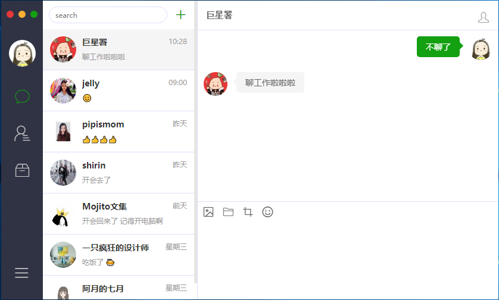
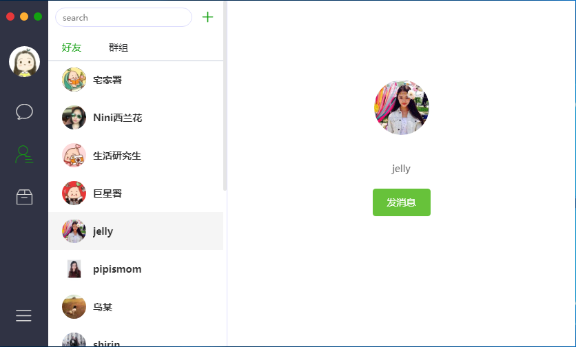

# Chat

> An electron-vue project

#### Build Setup

``` bash
# install dependencies
npm install

# serve with hot reload at localhost:9080
npm run dev

# build electron application for production
npm run build

```

## 打包

## 技术
* electron-vue
* electron
* sass
* mock

## electron 知识点应用
* window
* dialog

……

## 功能
* 聊天(待)

    * 发送图片
    * 文件
    * 截图
    * 表情
* 通讯录 

    * 好友
    * 群组
* 收藏(待)
* 搜索(待)

## 难点总结

## 截图



